# 🤖 AI Agents Team — Cérebro de equipe para agentes de IA



<p align="center">
  
</p>

<p align="center"><strong>Experimento em Python para coordenação de agentes de terminal e decisões colaborativas.</strong></p>

4 agentes de IA de terminal + 1 cérebro de equipe que faz eles **conversarem entre si**
em vez de só responderem o usuário.

```
terminal_ai.py   → chat com IA (OpenAI/Gemini)
agent_ai.py      → agente autônomo que executa tarefas no terminal
nexus.py         → agente avançado com web search, memória e auto-instalação
localia.py       → IA local que só abre com pendrive conectado (llama.cpp, 100% offline)
team_brain.py    → o cérebro: faz os agentes pensarem JUNTOS em debate
```

## 🧠 Modo EQUIPE (novo)

Cada agente agora tem um modo onde **vários papéis debatem antes de responder** —
cada um vê a fala do outro, constrói sobre ela ou disputa com alternativa concreta.

| Agente | Como ativar | Papéis no time |
|---|---|---|
| terminal_ai | `python3 terminal_ai.py --team` (ou `/team` no chat) | ARQUITETO, DEV, HACKER, INOVADOR |
| agent_ai | `python3 agent_ai.py --team` | PLANEJADOR, EXECUTOR, REVISOR |
| nexus | `python3 nexus.py --team` | ANALISTA, EXECUTOR, REVISOR |
| localia | `python3 localia.py --team` (ou `--time`) | LOCALIA, PLANEJADOR, REVISOR |

### Como o debate funciona
1. **Rodada 1** — cada papel pensa sozinho e dá sua visão
2. **Rodada 2** — cada papel VÊ as falas dos colegas e responde **a um deles**
   ("Concordo com o DEV e somo que...", "Discordo do HACKER: alternativa...")
3. **Rodada 3** — cada um assume um papel na execução ("EU FAÇO: ...")
4. **Síntese** — o líder organiza tudo em plano único com dono de cada passo

### Regras anti-manada
- Ninguém repete o que o colega já disse
- Proibido clichês ("perfeito não existe", "MVP primeiro", "depende")
- Discordar sempre com alternativa concreta
- Toda fala referencia um colega pelo nome

## 🚀 Uso

```bash
# configurar (1ª vez)
python3 terminal_ai.py --config

# chat normal
python3 terminal_ai.py

# chat com a equipe pensando junto
python3 terminal_ai.py --team
```

### LOCALIA (pendrive)

```bash
bash localia_prep.sh          # prepara o pendrive (estrutura + modelo)
python3 localia.py            # abre só com o pendrive conectado
python3 localia.py --prep     # cria estrutura LOCALIA no pendrive
```

Requere `llama-cpp` no Termux: `pkg install llama-cpp` (ou `ollama`).

## 🔐 Chaves de API

Coloque as chaves com `--config` (ficam em `~/.terminal_ai_config.json`,
`~/.agent_ai_config.json`, `~/.nexus/config.json`) ou nas variáveis de ambiente.
**Nunca coloque chaves no código.** Veja `.env.example`.

## 📦 Stack

Python puro (stdlib) — zero dependências. Testado no Android/Termux e Linux.

## Segurança de execução

O NEXUS inicia em **modo seguro**. Nesse modo, comandos são limitados a uma lista pequena de ferramentas de leitura e validação, operadores de shell são recusados, a execução arbitrária de Python permanece desativada e operações de arquivos ficam confinadas ao diretório de trabalho ativo. A instalação automática de pacotes também começa desativada.

O projeto não deve receber chaves, tokens ou arquivos `.env` no repositório. Configure credenciais apenas localmente, conforme o arquivo `.env.example` e as instruções de cada ferramenta.

Para verificar as guardas locais do NEXUS:

```bash
python3 tests/test_security_policy.py
```
